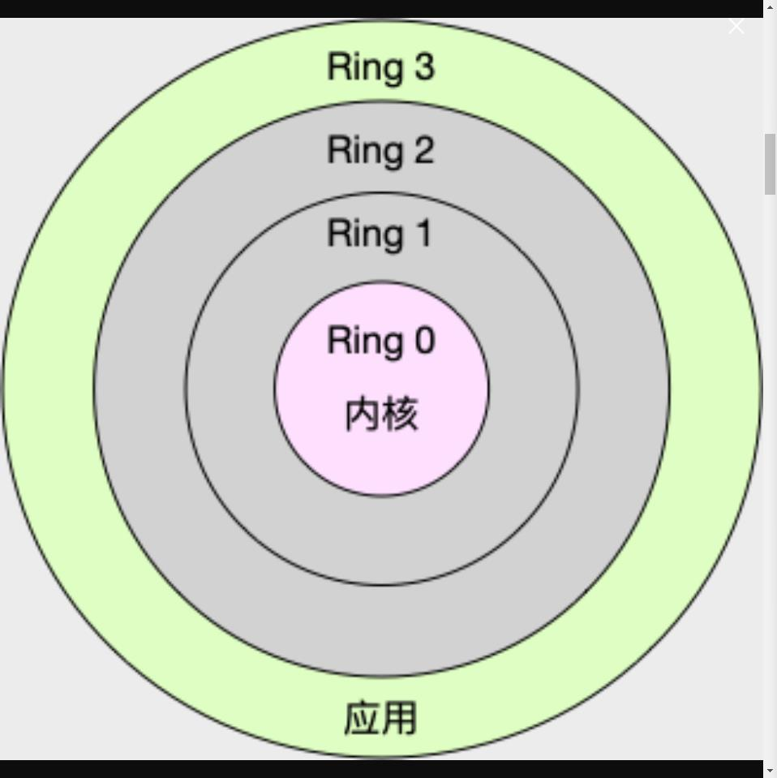
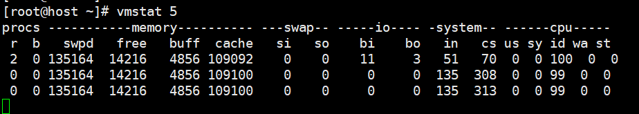

# 平均负载

平均负载是指单位时间内，系统处于可运行状态和不可中断状态的平均进程数，也就是平均活跃进程数，它和 CPU 使用率并没有直接关系。

可运行状态：是指正在使用 CPU 或者正在等待 CPU 的进程，ps命令看到处于R状态（runing或者Runnable）的进程。

不可以中断状态：正处于内核关键流程中的进程，并且这些流程是不可打断的，比如最常见的是等待硬件设备的I/O相应，也是就是我们在ps命令中看到的D状态（Uninterruptible Sleep，也成为Disk Sleep)的进程。磁盘度写数据时，为了保证数据的一致性，在得到磁盘回复前，它是不能被其他的进程或者中断打断的，这个时候程序就是处于不可中断状态，如果此时的进程被打断了，就很容易出现磁盘数据与进程数据不一致的问题。

不可中断状态实际上是系统对进程和硬件设备的一种保护机制。

所以，那么最理想的，就是平均负载等于cpu核数，每个进程运行在一个cpu核上。

查看cpu核数命令

`grep 'model name' /proc/cpuinfo | wc -l`


uptime 查看1 5 15分钟的平均负载，可以根据这三个值分析真个系统的负载变化情况。

当系统满载
大于70%时，应该查找原因，该值也只是个经验值,一旦负载过高，就有可能导致进程变慢。


#平均负载和cpu使用率

处于可运行状态和不可中断状态的进程，不仅仅包含了<font color="red">***正在使用cpu的*** 还包括等待cpu和等待IO的</font>

平均负载和cpu使用率不一定成对应关系。

* cpu密集型，使用大量cpu会导致平均负载升高，此时两者是一致的,<font color="red">***此时%user会很高***</font>；
* I/O密集型，等待I/O也会导致平均负载升高，但cpu使用率不一定很高，<font color="red">***此时%IOWait 和%sys会高,%cpu可能会高***</font>；
* 大量等待cpu的进程调度也会导致平均负载升高，此时的cpu使用率也会比较高,<font color="red">***此时%wait会高***</font>；

Cpu使用情况的查看工具：
top [top使用详情](../linux_comand/top.md)
dstat --top-cpu

iostat

mpstat

pidstat 是一个常用的进程性能分析工具，用来实时查看进程的 CPU、内存、i/o以及上下文切换等性能指标。

压力测试工具的安装
​	
​	下载命令
​	
​	`wget  http://people.seas.harvard.edu/~apw/stress/stress-1.0.4.tar.gz`

# cpu上下文切换

linux是多任务操作系统，它支持远大于cpu数量的任务同时运行，这些任务并不是真的同时运行，而是系统在很短的时间内，将cpu轮流分配给他们，造成多任务同时运行的假象。

在任务运行前，cpu需要知道任务从哪里加载，从哪里开始运行，及系统需要设置好<font color="red">**cpu寄存器和程序计数器（programcounter， pc)**</font>；

**cpu上下文环境：包括cpu寄存器环境和程序计数器环境**

上下文切换：保存上一个任务的寄存器数据和程序计数器数据（这些数据会保存在内核中，便于下次内核加载），加载新任务的寄存器数据和程序计数器，最后跳转到程序计数器所指的新位置，运行新的任务。

任务：进程任务，线程任务，中断任务。

根据任务的不同：上下文切换包括了进程上下文切换，线程上下文切换，中断上下文切换。

## 进程上下文切换

linux按照特权等级，把进程的运行分为内核空间和进程空间，对应如下，cpu特权等级的Ring0到Ring3

* 内核空间Ring0具有最高权限，可以直接访问左右资源。
* 用户空间Ring3只能访问受限资源，不能直接访问内存等硬件设备，必须通过系统调用陷入到内核中，才能访问这些特权资源。



进程在用户空间运行时，称为进程的用户态

进程在内核空间运行时，称为进程的内核态

从用户态到内核态的转换需要通过系统调用来完成。所以系统调用也有cpu上下文的切换，cpu寄存器里原来用户态的指令位置需要保存起来，接着为了执行内核态代码，cpu寄存器需要更新为内核态指令的新位置，最后才是跳转到内核态运行内核任务。而调用完成后，cpu寄存器需要恢复原来保存的用户态，然后在切换到用户空间，继续运行进程。所以一次系统调用过程，其实是发生了两次cpu上下文的切换。不过系统调用过程并不会涉及到虚拟内存等进程用户态的资源，也不会切换进程，这和通过说的进程上下文切换还是不一样的。

* 进程上下文切换，是指一个进程切换到另外一个进程运行

* 而系统调用过程中一直是同一个进程在运行。系统调用又称为特权模式切换，而不是上下文切换。

### 进程上下文切换过程：

* 1、保存进程的虚拟内存、栈、
* 2、保存进程的内核状态和cpu寄存器
* 3、加载新进程的内核状态和cpu寄存器
* 4、刷新新进程的虚拟内存和用户栈

### 上下文切换带来的问题：

* 1、根据[tsuna](https://blog.tsunanet.net/2010/11/how-long-does-it-take-to-make-context.html)的测试报告，每次上下文切换需要及时纳秒到数微妙。
* 2、linux通过TLB(Translation Lookaside Buffer)来管理虚拟内存到物理内存的映射关系，当虚拟内存更新后，TLB也需要刷新， 内存的访问会随之变慢。特别是在多处理器系统上，缓存是被多个处理器共享的，刷新缓存不仅会影响当前处理器的进程，还会影响共享缓存的其他处理器的进程。

### 进程上下文切换的场景：

* 进程cpu时间片消耗完
* 系统资源不足时，要等到资源满足后才可以运行。
* 当前进程通过sleep这样的方法将自己主动挂起
* 有优先级更高的程序运行时
* 发生硬件中断时

### 线程上下文切换：

线程是调度的基本单位，进程是资源拥有的基本的单位。内核中的调度对象是线程；而进程是给线程提供了虚拟内存、全局变量等资源。

* 当进程只有一个线程时，可以认为进程就等于线程
* 当进程拥有多个线程时，这些线程会共享相同的虚拟内存和全局变量等资源，这些资源在线程上下文切换的时候是不需要修改的。
* 另外，线程也要自己的私有数据，比如栈和寄存器等，这些在上下文切换的时候是需要修改的。

线程上下文切分又分为：

* 前后两个线程属于不同进程,此时资源不共享，所以切换过程和进程切换过程是一样的
* 前后两个线程属于一个进程，资源共享，虚拟内存保持不变，只需要切换线程的是有数据、寄存器等不共享的数据。

<font color='red' size='5'>所以多线程相比多进程消耗更少的资源</font>

## 中断上下文切换

为了快速响应硬件的事件，中断处理会打断进程的正常调度和执行，转而调用中断处程序，响应设备事件。在打断其他进程时，就需要将进程当前状态保存下来，这样在中断结束后，进程仍然可以从原来的状态恢复运行。

跟进程上下文不同，中断上下文切换并不涉及到进程的用户态。所以，即便中断过程打断了一个正处在用户态的进程，也不需要保存和恢复这个进程的虚拟内存、全局变量等用户态资源。中断上下文，其实只包括内核态中断服务程序执行所必需的状态，包括 CPU 寄存器、内核堆栈、硬件中断参数等。

<strong>对同一个 CPU 来说，中断处理比进程拥有更高的优先级</strong>，所以中断上下文切换并不会与进程上下文切换同时发生。同样道理，由于中断会打断正常进程的调度和执行，所以大部分中断处理程序都短小精悍，以便尽可能快的执行结束。

另外，跟进程上下文切换一样，中断上下文切换也需要消耗 CPU，切换次数过多也会耗费大量的 CPU，甚至严重降低系统的整体性能。所以，当你发现中断次数过多时，就需要注意去排查它是否会给你的系统带来严重的性能问题。

## 怎么查看系统上下文切换情况

### vmstat 

是一个常用的系统性能分析工具，主要用来分析系统的内存使用情况，也常用来分析cpu上下文切换和中断次数

命令如下：

```
vmstat 5
```



[vmstat使用详情](../tool/vmstat.md)

### pidstat

是sysstat工具的一个命令，用于监控全部或指定进程的cpu、内存、线程、设备IO等系统资源的占用情况。pidstat首次运行时显示自系统启动开始的各项统计信息，之后运行pidstat将显示自上次运行该命令以后的统计信息。用户可以通过指定统计的次数和时间来获得所需的统计信息。

[pidstat使用详情请](../tool/pidstat.md)

比如说：

```
# 每隔 5 秒输出 1 组数据
$ pidstat -w 5
Linux 4.15.0 (ubuntu)  09/23/18  _x86_64_  (2 CPU)

08:18:26      UID       PID   cswch/s nvcswch/s  Command
08:18:31        0         1      0.20      0.00  systemd
08:18:31        0         8      5.40      0.00  rcu_sched
...

```

这个结果中有两列内容是我们的重点关注对象。一个是  cswch  ，表示每秒自愿上下文切换（voluntary context switches）的次数，另一个则是  nvcswch  ，表示每秒非自愿上下文切换（non voluntary context switches）的次数。

* 所谓自愿上下文切换，是指进程无法获取所需资源，导致的上下文切换
* 非自愿上下文切换，则是指进程由于时间片已到等原因，被系统强制调度，进而发生的上下文切换。

### 操作分析

打开一个终端运行 vmstat ，观察上下文切换情况:


在另外一个终端里运行 sysbench ，模拟系统多线调度的瓶颈：

```
以 10 个线程运行 5 分钟的基准测试，模拟多线程切换的问题
$ sysbench --threads=10 --max-time=300 threads run
```

* r列：就绪队里的长度增加，远大于cpu个数1，所以肯定有大量的cpu竞争
* us和sy列：加起来cpu使用100%，sy高到87%,说明cpu主要是被内核占用了。
* ni列：中断次数也上升到了1000，说明中断处理也存在潜在问题。

综上，系统的就绪队列过长 ，也就是等待cpu的进程数过多，导致了大量的上下文切换，而上下文切换导致了系统的cpu使用率上升高。

通过pidstat查看情况：

```
pidstat -w -u 1
```


分析系统中断高问题：

```
watch -d cat /proc/interrupts
```

