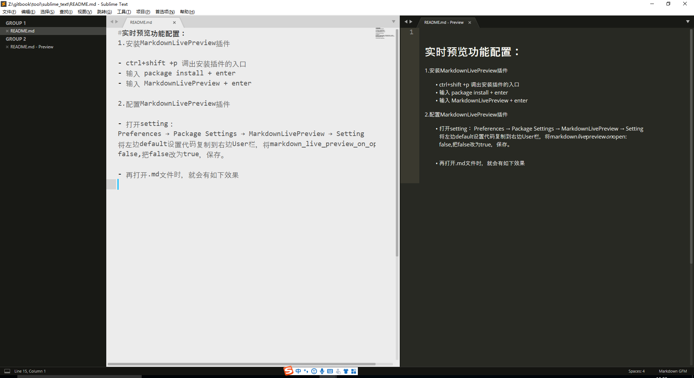

#实时预览功能配置：
1.安装MarkdownLivePreview插件
    
- ctrl+shift +p 调出安装插件的入口
- 输入 package install + enter
- 输入 MarkdownLivePreview + enter

2.配置MarkdownLivePreview插件

- 打开setting：
Preferences → Package Settings → MarkdownLivePreview → Setting
将左边default设置代码复制到右边User栏，将markdown_live_preview_on_open: false,把false改为true，保存。

- 再打开.md文件时，就会有如下效果

3.安装 Markdown editing插件(用于markdown编译)

- ctrl+shift +p 调出安装插件的入口
- 输入 package install + enter
- 输入 Markdown editing + enter

4.快捷键

    ctrl +p 查找
 
    ctrl + f 查找
    
    crtl +shift + F 查找
    
    ctrl + shift + p 安装
    
    ctrl + u 后退

    ctrl+g 跳转到对应行

